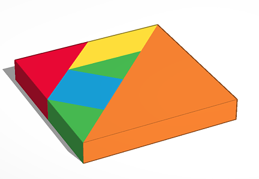

# Tangram: Una propuesta didáctica para ver contenidos de geometría

El Tangram es un rompecabezas chino que consiste en un conjunto de 7 piezas con el que se pueden realizar multitud de siluetas. El juego consiste en coger una silueta e intentar reproducirla utilizando justamente las 7 piezas.

## Objetivos

Los objetivos de la actividad son los siguientes:

    - Teorema de Pitágoras
    - Perímetros y áreas
    - Volúmenes
    - ...

## Actividades

### Actividad 1

Deducir el teorema de Pitágoras de forma gráfica y manipulable