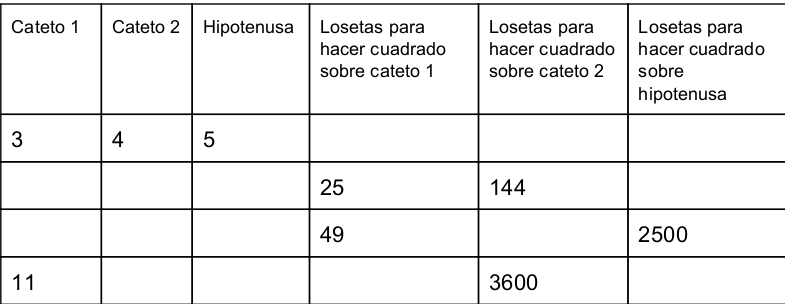

#Actividad 1

#Fecha:
#Nombres:

##Descubriendo Pitágoras: Deducción de la fórmula

###Grupos
Poneros por parejas para realizar la actividad

###Materiales y construcción
Consigue un triángulo rectángulo de lados 3, 4 y 5 cm y un cuadrado de 1 cm de arista al que llamaremos loseta. Si no tienes los materiales, los puedes construir tú mismo (el triángulo es rectángulo de catetos 3cm y 4 cm, es decir los segmentos de 3 y 4 cm son perpendiculares)

###Desarrollo de la actividad

Tienes que rellenar la tabla que aparece al final y responder a las siguientes cuestiones:

    - ¿Cuántas losetas necesitas para construir un cuadrado sobre el cateto
    pequeño? Piénsalo con tus compañeros primero, y compruébalo dibujando la solución.
    Para ello, dbuja la silueta del triángulo en una hoja y sobre el lado ves dibujando
    las losetas que necesitas -recuerda que tienes que dibujar un cuadrado apoyado en el lado-.
    - ¿Cuántas losetas necesitas para construir un cuadrado sobre el otro
    cateto? Repite el proceso anterior
    - Finalmente, ¿cuántas losetas necesitas para construir un cuadrado
    sobre la hipotenusa?, ¿puedes construirlo con el número de losetas que ya
    has dibujado?, ¿por qué?
    - ¿Qué relación hay entre el número de losetas del cuadrado de la hipotenusa y los cuadrados
    de los catetos?
    - Completa la siguiente frase: "El cuadrado de la ___________ es igual a la suma de los _________
    de los _____________"
    - Completa la siguiente tabla:
    

    