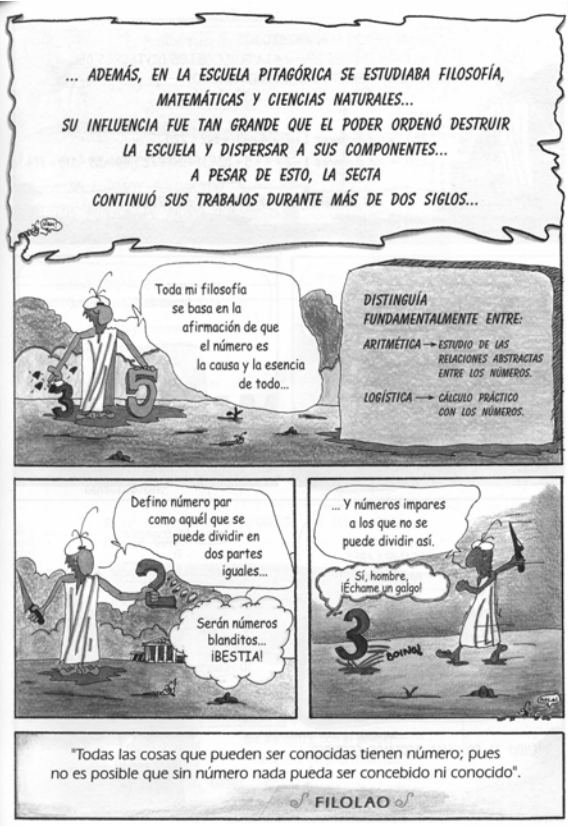

#Actividad 2

#Fecha:
#Nombres:

##Descubriendo Pitágoras: Un poco de Historia

###Grupos
Poneros por parejas para realizar la actividad

###Materiales y construcción
Acceso a Internet

###Desarrollo de la actividad

Al final de la actividad tienes que dibujar una viñeta, en formato cómic, que refleje la Historia de Pitágoras. La historia tiene que tener al menos 6 viñetas. Aquí tienes un ejemplo de cómo puede ir quedando:

Al final de la clase enseñarás tu trabajo al resto. Para ello, busca en Internet la siguiente información:

1. ¿Cuándo y dónde nació Pitágoras?. ¿En qué época de la Historia se produjo?.

1. ¿Qué secta filosófica-religiosa inspiró a Pitágoras?

1. ¿Quién descubrió realmente el teorema de Pitágoras?

1. ¿Qué dice el teorema de Pitágoras? Explícalo para un triángulo rectángulo

1. Invéntate un rap sobre Pitágoras de 4 líneas e inclúyelo en tus viñetas.

1. ¿Cuándo murió Pitágoras?

